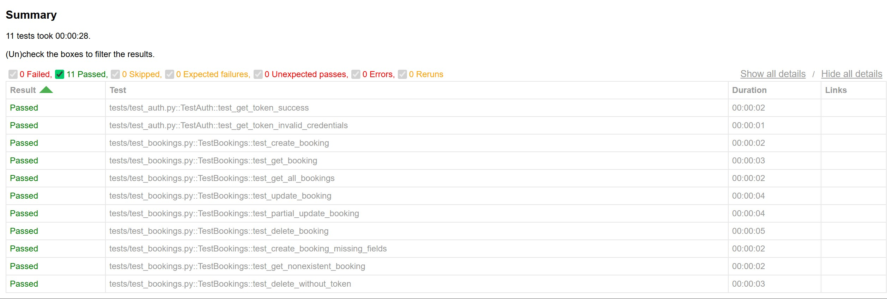

# RestfulBooker API Testing Framework


Automated API testing framework for RestfulBooker using Python, pytest, and requests.

## Features

- Complete CRUD operations testing
- Authentication and token management
- Negative test scenarios
- HTML reporting
- Page Object Model (POM) architecture
- CI/CD ready with GitHub Actions

## Test Coverage

- **Authentication Tests**: 2 tests
- **Booking CRUD Tests**: 6 tests
- **Negative Tests**: 3 tests
- **Total**: 11 automated tests

## Tech Stack

- Python 3.11
- pytest
- requests
- pytest-html

## Project Structure
```
QA_API_RestfulBooker/
├── api/
│   ├── base_api.py          # Base HTTP methods
│   ├── auth_api.py           # Authentication endpoints
│   └── booking_api.py        # Booking CRUD endpoints
├── models/
│   └── booking_model.py      # Booking data model
├── tests/
│   ├── test_auth.py          # Authentication tests
│   └── test_bookings.py      # Booking CRUD tests
├── reports/                   # HTML test reports
├── conftest.py               # Pytest fixtures
├── pytest.ini                # Pytest configuration
└── requirements.txt          # Dependencies
```

## Installation

1. Clone the repository
```bash
git clone https://github.com/arturdmt-alt/QA_API_RestfulBooker-.git
cd QA_API_RestfulBooker
```

2. Create virtual environment
```bash
python -m venv venv
venv\Scripts\activate  # Windows
```

3. Install dependencies
```bash
pip install -r requirements.txt
```

## Running Tests

Run all tests:
```bash
pytest -v
```

Run with HTML report:
```bash
pytest -v --html=reports/report.html --self-contained-html
```

Run specific test file:
```bash
pytest tests/test_auth.py -v
```

## Test Results

All tests passing: 11/11



View HTML report: `reports/report.html`

## Author

Artur - QA Automation Engineer


