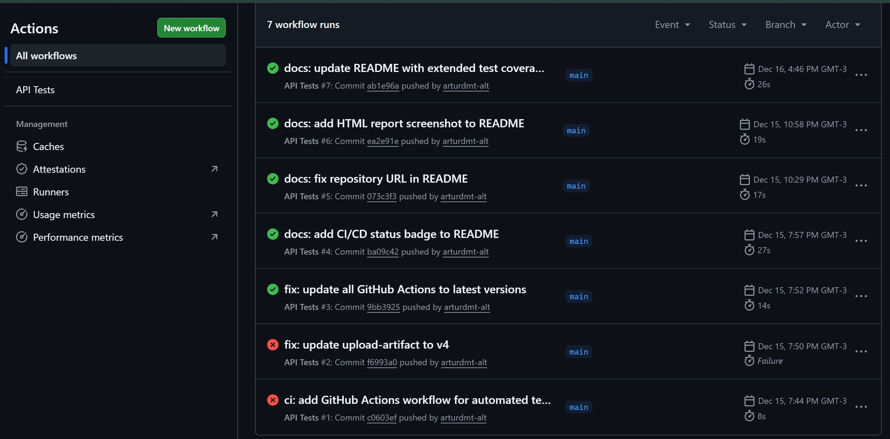

# RestfulBooker API Testing Framework

[](https://github.com/arturdmt-alt/QA_API_RestfulBooker-/actions/workflows/tests.yml)

Automated API testing framework for **RestfulBooker** built with **Python, pytest and requests**, designed to demonstrate a clean, scalable and professional QA Automation approach.

---

## Features

* Complete CRUD testing for Booking endpoints
* Authentication and token management
* Positive and negative test scenarios
* **Schema validation using Pydantic**
* Data validation and business rules checks
* HTML test reporting with pytest-html
* Modular and maintainable architecture
* **CI/CD pipeline with GitHub Actions**

---

## Test Coverage

* **Authentication tests** (valid & invalid scenarios)
* **Booking CRUD tests** (create, read, update, partial update, delete)
* **Negative tests** (missing fields, invalid credentials, non-existent resources)
* **Schema validation tests** (response structure, data types, constraints)

**Total:** 24 automated tests - All passing 

---

## Tech Stack

* Python 3.11
* pytest
* requests
* pydantic
* pytest-html
* GitHub Actions (CI)

---

## Project Structure
```
QA_API_RestfulBooker/
├── api/
│   ├── base_api.py          # Base HTTP methods abstraction
│   ├── auth_api.py          # Authentication endpoints
│   └── booking_api.py       # Booking CRUD endpoints
├── schemas/
│   └── booking_schema.py    # Pydantic schemas for response validation
├── tests/
│   ├── test_auth.py         # Authentication tests
│   ├── test_bookings.py     # Booking CRUD tests
│   └── test_schema_validation.py  # Schema & data validation tests
├── reports/                 # HTML test reports
├── screenshots/             # Project documentation images
├── conftest.py              # Pytest fixtures
├── pytest.ini               # Pytest configuration
└── requirements.txt         # Dependencies
```

---

## Installation

1. Clone the repository
```bash
git clone https://github.com/arturdmt-alt/QA_API_RestfulBooker-.git
cd QA_API_RestfulBooker
```

2. Create and activate virtual environment
```bash
python -m venv venv
venv\Scripts\activate  # Windows
```

3. Install dependencies
```bash
pip install -r requirements.txt
```

---

## Running Tests

Run all tests:
```bash
pytest -v
```

Run with HTML report:
```bash
pytest -v --html=reports/report.html --self-contained-html
```

Run a specific test file:
```bash
pytest tests/test_auth.py -v
```

---

## CI/CD Pipeline

All tests run automatically on every push via GitHub Actions:



The pipeline:
* Runs on Python 3.11
* Executes all 24 tests
* Generates HTML reports
* Validates code on every commit

---

## Test Results


* **24/24 tests passing** 
* CI pipeline green 
* Full HTML report available in `reports/report.html`

---

## Key Learnings

Working on this project helped me develop:

* **Schema validation** with Pydantic for strict API contract testing
* **CI/CD configuration** and troubleshooting in GitHub Actions
* **Modular architecture** design for maintainable test frameworks
* **Balance** between comprehensive coverage and code simplicity

These skills directly translate to real-world QA automation in Agile teams.

---

## Notes

This framework focuses on clarity, maintainability and realistic QA practices rather than artificial complexity. It is structured to be easily extended with additional endpoints, environments or validations.

---

## Author

**Artur Dmytriyev**  
QA Automation Engineer

[LinkedIn](https://www.linkedin.com/in/arturdmytriyev/)  
[GitHub](https://github.com/arturdmt-alt)


